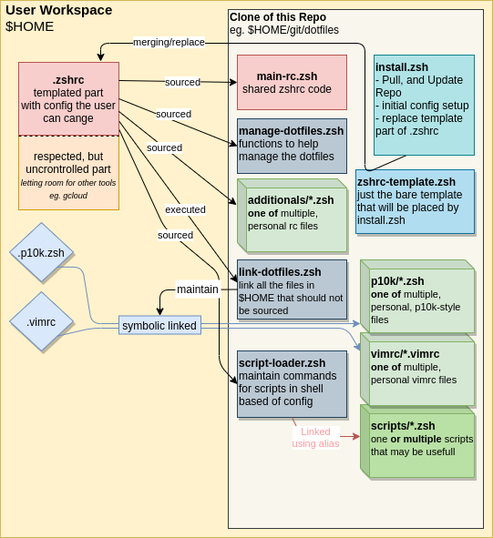

# Fuog's Dotfiles

The idea behind this Repo is to share a zshrc between friends and multiple devices. You will need to have some shared-interest in "how" a basic "shared-zshrc" should look like while also leaving space for personal stuff that others don't want or you would not need on other devices.

It's more or less a "let's collaborate on semi-personal stuff"

This repo will also respect code that is added by other tools to the main `.zshrc` while updating its own part.

## Disclaimer

This repo tested with Ubuntu Linux 21.04 and may also require tools that are not installed by this Repo. Usage by your own risk.

## How does it Work?



## install prerequisites

This Repo does not install any prerequisites for the full features it can load at shell-launch. In most cases, should a dependency not be installed, the feature will just not be activated. Thats why most of the dependencies are "optionals" and will result in a smaller feature-stack if the prerequisites are ignored.

- [install and enable ZSH](https://github.com/ohmyzsh/ohmyzsh/wiki/Installing-ZSH) as your user shells
- optionals
  - install [golang](https://golang.org/doc/install) atleast v1.13 (Ubuntu 20.04+), for `fzf`
  - install [kubectl](https://kubernetes.io/docs/tasks/tools/) (any source)
  - install [grc](https://github.com/garabik/grc)
  - install [fzf](https://github.com/junegunn/fzf) ( with `go get github.com/junegunn/fzf` or see [Howto](https://github.com/junegunn/fzf#installation) )

## Principals

- The core part of the dotfiles should be a consense of everyone that colaborates with this repo.
- Every part that is personal or otherwise not shared should be placed within folders and loaded or linked
  - `p10k` for personal p10k styles you would normally find at `$HOME/.p10k.zsh`
  - `additionals` mostly for other zshrc-stuff that is not shared
  - `vimrc` just the config for vimrc to use
  - `scripts` a list of scripts (from `./scripts` ) selected by the user and made available as alias in shell
- the code should alway check if requierements are met before executing something within the rc
- a update should always be possible
- we don't use oh-my-zsh but [ZI](https://z.digitalclouds.dev/)
  - don't combine oh-my-zsh with this repo's approach

## install dotfiles

This is a quick way to install dotfiles:

```bash
$SHELL <(curl -s "https://raw.githubusercontent.com/fuog/dotfiles/master/install.zsh") # will install to $HOME/git/team-dotfiles

$SHELL <(curl -s "https://raw.githubusercontent.com/fuog/dotfiles/master/install.zsh") "$HOME/git/private/dotfiles" # for custom locations
```

## More Copy&Paste

__Example1__ for setting all up in two blows

```bash
mkdir -p "$HOME/git"; $SHELL <(curl -s "https://raw.githubusercontent.com/fuog/dotfiles/master/install.zsh")
```

```bash
dotfiles vimrc fuog-default.vimrc; dotfiles p10k fuog-full.zsh; dotfiles additionals fuog-default.zsh
```

__Example2__ for setting things up without direct execution.. for some proxy problems ..

```bash
mkdir -p "$HOME/git"; git clone https://github.com/fuog/team-dotfiles.git "$HOME/git/team-dotfiles"; $HOME/git/team-dotfiles/install.zsh
```

```bash
dotfiles vimrc fuog-default.vimrc; dotfiles p10k fuog-full.zsh; dotfiles additionals fuog-default.zsh
```

## dotfiles tool usage

After Install, you can use a tool for selecting your personal files. Just add your personal files to the folders and activate them.

```bash
❯ dotfiles
Usage: dotfiles [subcommand]
 ..  repopath <file>            specify the folder manually
 ..  additionals <file>         select or specify the file manually
 ..  p10k <file>                select or specify the file manually
 ..  vimrc <file>               select or specify the file manually
 ..  scripts "<file1> <file2>"  select or specify the files manually (multiple)
                                (not implemented for now)
 ..  install/update             just run the install/update script again
                                (update repo && update .zshrc template)

❯ dotfiles additionals my-personal-stuff.zsh
Setting ADDITIONALS-File to .zshrc
```

## Links

- ZI (plugin manager) <https://z.digitalclouds.dev/>
